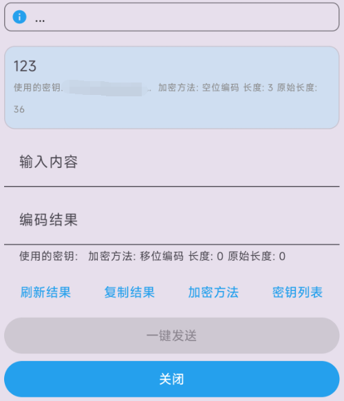
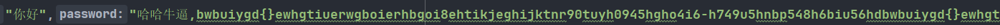
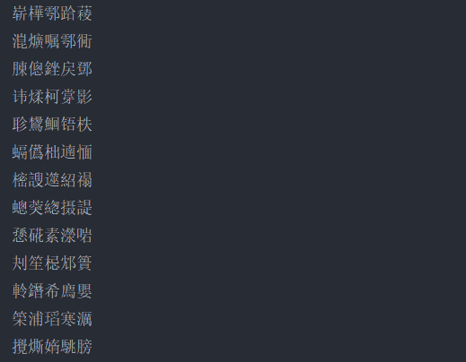

# 介绍
\
安卓平台全自动信息编码解码软件\
已发布版本: \
https://gitlab.com/invertgeek1/MixMessage/-/releases
## 特点
基于无障碍服务,需要授权无障碍权限和悬浮窗权限,建议关闭省电模式并开启自启动\
能自动解码基本所有软件中的文本信息,并弹出快捷编码对话窗口\
一键发送功能可直接识别当前界面中的发送按钮和输入框，做到一键编码后发送

## 用法
安装后在手机设置->无障碍->已安装应用->MixMessage智能解码->启用 即可\
同时要授予悬浮窗权限\
然后在任意软件输入框内输入mix,然后点击输入后的文字即可弹出发送窗口\
如果不行直接发送后再点击发送后信息的mix字符即可\
建议设置自启动权限以及关闭省电限制

## 功能
### 一键加密
一键加密并发送您输入的内容
### 自动解密
点击文字时自动解密并显示内容对话框
### 密钥列表
可自定义添加多条密钥,解密时会自动尝试所有密钥\
支持密钥锁定,使用自定义密码一键加密并锁定密钥列表\
支持自动锁定,规定时间未使用解密功能自动加密并锁定所有密钥\
用某条密钥加密的信息,只有密钥列表拥有这条密钥的人才能解密\
即使对方拥有此软件,不知道您设置的密钥,同样无法解密您发送的信息
### 时间锁
开启后当天加密的信息只能在当天点开\
支持自定义密钥
### 移位加密
特点: 每次加密后结果都不相同.只比原文多三个字符,需要密钥正确才能解密\
缺点：只能加密中文英文和数字,特殊字符无法加密\
例如: 加密中文"你好"二字100次,后面的"哈哈牛逼"开头的为密钥字符串\
每次加密结果都不相同,后方密钥只要错一个字符,就无法解密出任何内容\

### 其他加密
其他加密默认为使用特定字符集作为进制编码移位加密后的数据,拥有移位加密相同的随机结果特性\
空位加密使用的是不可见字符,长度为0,默认会加x+随机数字的前缀,可自行设置

### 启动白屏
支持启动后白屏,双指放大解锁
### APP伪装
支持更改图标和应用名称伪装成其他APP

## 缺陷
一键发送功能失败自行重试即可,如果无法发送请手动发送一条消息后再试\
切换软件后,缓存会刷新,所以第一次可能会失败,保持停留在当前页面后面的操作都会成功\
小米开启输入法隐私模式后在输入框内输入mix点击后有概率弹出快捷窗口失败
